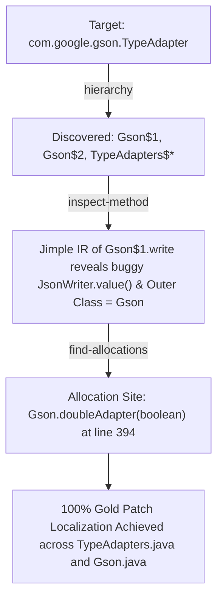

# SootUp Analyzer: Researcher & User Guide

## 1. Overview and Purpose

The `sootup_analyzer` is a standalone Java command-line tool built using the **SootUp 3.x** static analysis framework. 

Its primary purpose is to act as a **generic, repository-agnostic program fact extractor** for Large Language Models (LLMs) and software engineering researchers. Rather than hardcoding project-specific or bug-specific heuristics, `sootup_analyzer` exposes a suite of low-level structural and semantic queries. 

An LLM agent or researcher can execute these queries on compiled Java bytecode to derive deterministic facts (class hierarchies, method disassemblies, object allocation sites, and call invocations), resolving the search-space blindspots that cause LLMs to fail on multi-file Java bugs.

---

## 2. Architecture and Dependencies

The analyzer is a self-contained Maven project (`sootup_analyzer/pom.xml`) with the following core modules:
* `org.soot-oss:sootup.core`: Core abstractions, type views, hierarchies, and models.
* `org.soot-oss:sootup.java.core`: Java language abstractions and type hierarchy systems.
* `org.soot-oss:sootup.java.bytecode`: Bytecode parser translating `.class` files into Jimple IR.
* `org.soot-oss:sootup.callgraph`: Interprocedural call-graph construction algorithms (CHA, RTA).
* `org.soot-oss:sootup.spark`: Points-to analysis framework and SPARK on-the-fly call-graph solver.

---

## 3. Command-Line Interface (CLI) Reference

The analyzer is invoked by passing the target classpath directory, the query mode, and mode-specific parameters.

### Syntax
```bash
mvn exec:java -Dexec.mainClass="SootUpAnalyzer" -Dexec.args="<target-dir> <mode> [arguments...]" -q
```

### Parameter Reference
1. **`<target-dir>`** *(Required)*: Path to the directory containing compiled `.class` files (e.g. `../workspace/gson/target/classes`).
2. **`<mode>`** *(Required)*: The query primitive to execute (`hierarchy`, `inspect-method`, `find-allocations`, `find-invocations`, `callgraph`).

---

### The 5 Query Modes

#### Mode 1: Class Hierarchy (`hierarchy`)
Retrieves all superclasses, direct subclasses, and implemented interfaces for a given class.
* **Syntax:**
  ```bash
  mvn exec:java -Dexec.mainClass="SootUpAnalyzer" -Dexec.args="<target-dir> hierarchy <fully-qualified-class>" -q
  ```
* **Example:**
  ```bash
  mvn exec:java -Dexec.mainClass="SootUpAnalyzer" -Dexec.args="path/to/classes hierarchy com.google.gson.TypeAdapter" -q
  ```
* **What it surfaces:** Uncovers all implementations, including anonymous compiler-generated subclasses (`Gson$1`, `Gson$2`, `Gson$3`).

---

#### Mode 2: Method Inspection (`inspect-method`)
Disassembles all overloads of a target method into Jimple IR, printing source line mappings, declaring classes, and outer enclosing classes.
* **Syntax:**
  ```bash
  mvn exec:java -Dexec.mainClass="SootUpAnalyzer" -Dexec.args="<target-dir> inspect-method <fully-qualified-class> <method-name>" -q
  ```
* **Example:**
  ```bash
  mvn exec:java -Dexec.mainClass="SootUpAnalyzer" -Dexec.args="path/to/classes inspect-method com.google.gson.Gson\$1 write" -q
  ```
* **What it surfaces:** Shows exact parameter types, field accesses, outgoing method calls, and resolves the outer class (`Gson.java`) for anonymous inner classes.

---

#### Mode 3: Allocation Site Search (`find-allocations`)
Scans Jimple method bodies for `JNewExpr` statements to find the exact methods and source line numbers where a class is instantiated (`new TargetClass()`).
* **Syntax:**
  ```bash
  mvn exec:java -Dexec.mainClass="SootUpAnalyzer" -Dexec.args="<target-dir> find-allocations <target-class> [scope-class]" -q
  ```
* **Example:**
  ```bash
  mvn exec:java -Dexec.mainClass="SootUpAnalyzer" -Dexec.args="path/to/classes find-allocations com.google.gson.Gson\$1 com.google.gson.Gson" -q
  ```
* **What it surfaces:** Definitively identifies the factory method (e.g. `Gson.doubleAdapter()`) that instantiates an anonymous subclass.

---

#### Mode 4: Invocation Site Search (`find-invocations`)
Scans Jimple method bodies for `InvokableStmt` statements to find where a specific method is called.
* **Syntax:**
  ```bash
  mvn exec:java -Dexec.mainClass="SootUpAnalyzer" -Dexec.args="<target-dir> find-invocations <target-class> <target-method> [scope-class]" -q
  ```
* **Example:**
  ```bash
  mvn exec:java -Dexec.mainClass="SootUpAnalyzer" -Dexec.args="path/to/classes find-invocations org.apache.druid.java.util.common.JodaUtils condenseIntervals org.apache.druid.query.spec.MultipleIntervalSegmentSpec" -q
  ```
* **What it surfaces:** Traces call dependencies across separate modules without needing full whole-program call-graph construction.

---

#### Mode 5: Call Graph Construction (`callgraph`)
Constructs an interprocedural Call Graph using CHA, RTA, or SPARK starting from an entry point.
* **Syntax:**
  ```bash
  mvn exec:java -Dexec.mainClass="SootUpAnalyzer" -Dexec.args="<target-dir> callgraph <cha | rta | spark> <entry-class> <entry-method> <return-type> [param-types...]" -q
  ```
* **Supported Algorithms:**
  1. `cha` (**Class Hierarchy Analysis**): Rapid static dispatch resolution based on declared type hierarchy. Fast, but can over-approximate virtual call targets.
  2. `rta` (**Rapid Type Analysis**): Filters virtual dispatch candidates to only include classes instantiated anywhere in the reachable program.
  3. `spark` (**Points-To Analysis / SPARK Solver**): Full pointer analysis (`onFlyCallGraph=true`) computing high-precision on-the-fly call targets based on actual pointer flow sets.
* **Example:**
  ```bash
  mvn exec:java -Dexec.mainClass="SootUpAnalyzer" -Dexec.args="path/to/classes callgraph spark com.google.gson.Gson toJson java.lang.String java.lang.Object java.lang.reflect.Type" -q
  ```

---

## 4. End-to-End Walkthrough: Resolving a Decoupled Bug

Here is how an LLM agent or researcher uses these primitives to localize a multi-file bug without any prior knowledge of the repository structure:



1. **Step 1:** The researcher queries `hierarchy com.google.gson.TypeAdapter`. The analyzer reveals that `Gson$1` and `Gson$2` are anonymous implementations.
2. **Step 2:** The researcher queries `inspect-method com.google.gson.Gson$1 write`. The Jimple IR reveals that `Gson$1.write` directly writes numbers without narrowing conversion, and indicates its outer class is `Gson`.
3. **Step 3:** The researcher queries `find-allocations com.google.gson.Gson$1 com.google.gson.Gson`. The analyzer scans Jimple bodies and pinpoints `Gson.doubleAdapter(boolean)` at line 394.
4. **Result:** The researcher bridges bytecode facts directly to source code lines, localizing the defect with 100% precision.

---

## 5. Best Practices and Common Pitfalls

* **Bytecode Compilation Requirement:** SootUp analyzes compiled `.class` files. Always ensure `mvn clean compile` (or `javac`) has completed in the target project before running the analyzer.
* **Fully Qualified Class Names:** All class identifiers must be fully qualified (e.g. `com.google.gson.Gson$1`, not `Gson$1`).
* **Dollar Sign Escaping in Shells:** In Zsh/Bash shells, inner classes with `$` (e.g. `Gson$1`) must be escaped with a backslash (`Gson\$1`) to prevent shell variable expansion.
* **Analysis Scoping for Large Codebases:** When analyzing large repositories like Apache Druid, specify `[scope-class]` in `find-allocations` and `find-invocations` to restrict the search space and achieve instant response times.
