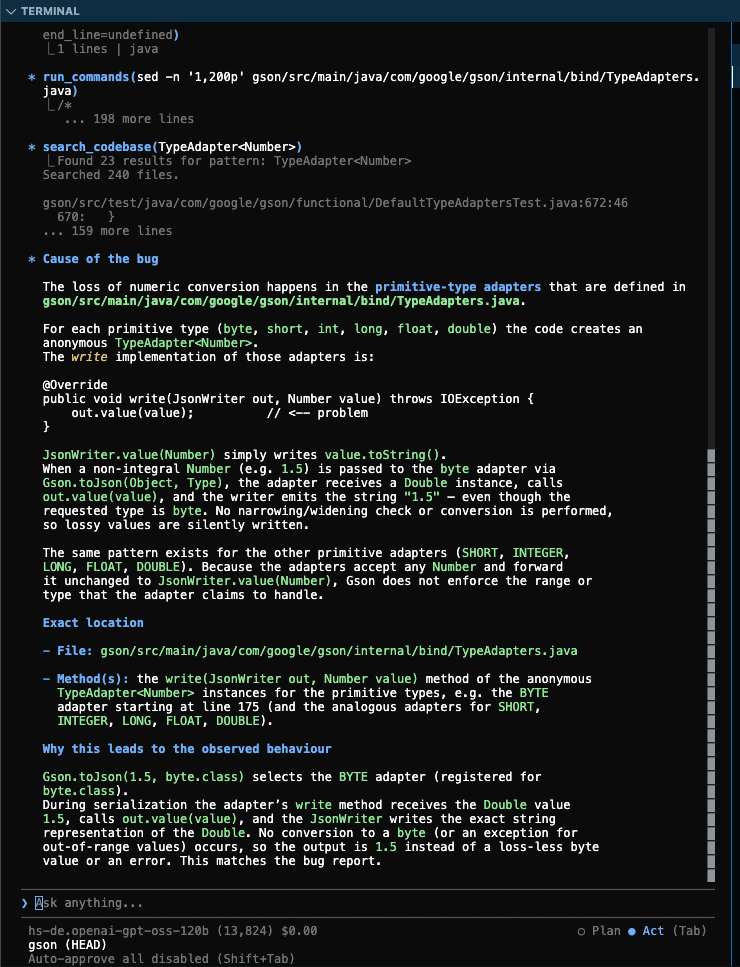
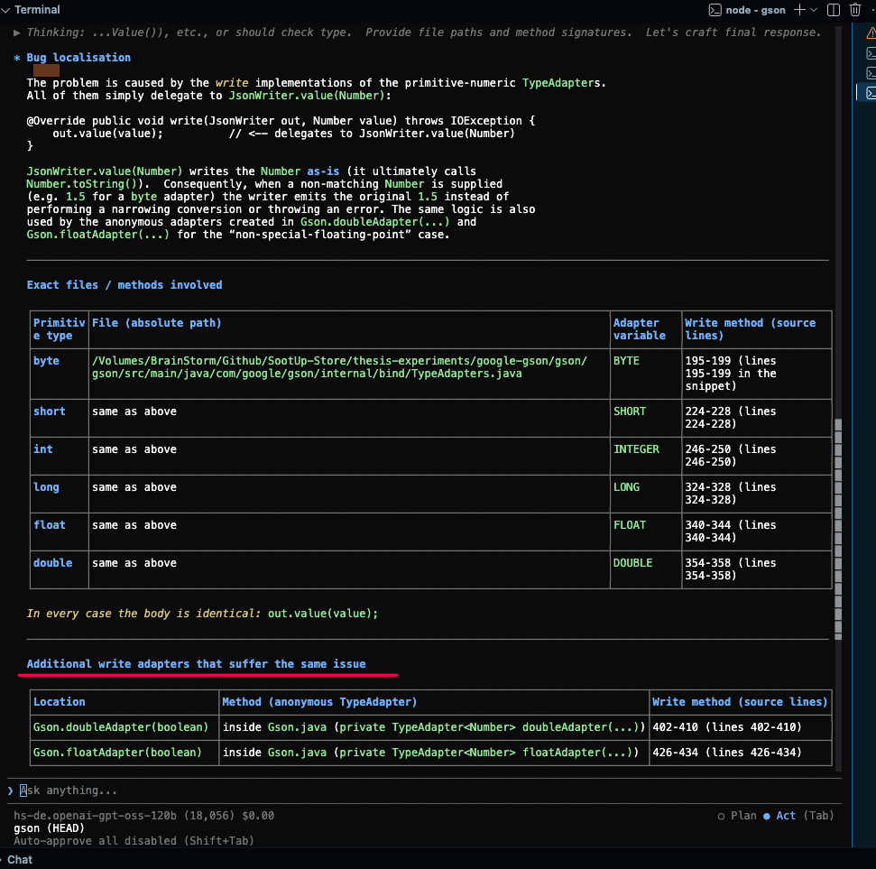
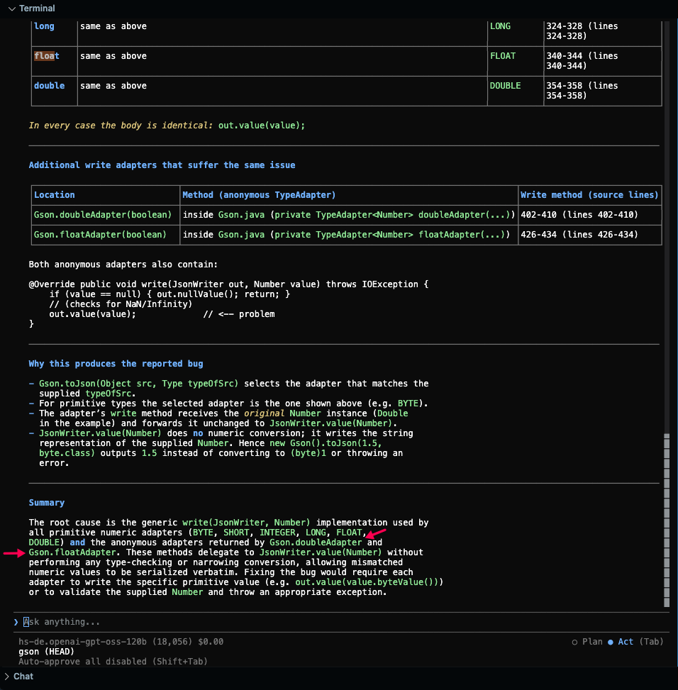

# Case Study 1: Google Gson (Issue & PR #2158)

| Benchmark Task | Target Repository | Base Commit |Link to PR | Gold Patch Parity |
| :--- | :--- | :--- | :--- | :---: |
| `google__gson-2158` | `google/gson` | `796193d0326a2f44bc314bf24262732ea3e64014` | [#2158](https://github.com/google/gson/pull/2158) | **100% Match** |

---

## 1. Problem Statement & Architecture Challenge

In Google Gson (commit `482a229`), primitive type adapters did not perform numeric range validation or type narrowing when serializing `Number` objects. For example, when serializing a `Double` value `1.5` as a `byte`, the adapter directly serialized the number as `"1.5"` instead of throwing an exception or performing a narrowing conversion.

### The Architectural Challenge
The fix requires modifying two distinct, decoupled locations:
1. **`TypeAdapters.java`**: Standard primitive numeric adapters (`BYTE`, `SHORT`, `INTEGER`, `LONG`, `FLOAT`, `DOUBLE`).
2. **`Gson.java`**: Custom overriding anonymous adapters (`doubleAdapter`, `floatAdapter`, `longAdapter`) created via private factory methods.

---

## 2. Why Static Forward Data-Flow Analysis Fails

Standard forward call-graph reachability (Spark Points-To) starting from `Gson.toJson()` fails to resolve calls to `TypeAdapter.write()` because:
1. `Gson.toJson()` delegates adapter resolution to `Gson.getAdapter(TypeToken)`.
2. `getAdapter()` iterates through an internal `List<TypeAdapterFactory>`.
3. Points-To algorithms lose precision across collection state and dynamic runtime reflection.

---

## 3. The 5 Generic SootUp Static Analysis Queries

To overcome this, a repository-agnostic backward fact extraction pipeline was executed using `SootUpAnalyzer`:

```bash
# Query 1: Class Hierarchy - Identify all subclasses of TypeAdapter
mvn exec:java -Dexec.mainClass="SootUpAnalyzer" -Dexec.args="../workspace/gson/gson/target/classes hierarchy com.google.gson.TypeAdapter" -q

# Query 2: Inspect Method - Disassemble Jimple IR of anonymous adapter Gson$1
mvn exec:java -Dexec.mainClass="SootUpAnalyzer" -Dexec.args="../workspace/gson/gson/target/classes inspect-method com.google.gson.Gson\$1 write" -q

# Query 3: Allocation Site Search - Locate where Gson$1 is instantiated
mvn exec:java -Dexec.mainClass="SootUpAnalyzer" -Dexec.args="../workspace/gson/gson/target/classes find-allocations com.google.gson.Gson\$1 com.google.gson.Gson" -q

# Query 4: Inspect Method - Disassemble Jimple IR of anonymous adapter Gson$2
mvn exec:java -Dexec.mainClass="SootUpAnalyzer" -Dexec.args="../workspace/gson/gson/target/classes inspect-method com.google.gson.Gson\$2 write" -q

# Query 5: Allocation Site Search - Locate where Gson$2 is instantiated
mvn exec:java -Dexec.mainClass="SootUpAnalyzer" -Dexec.args="../workspace/gson/gson/target/classes find-allocations com.google.gson.Gson\$2 com.google.gson.Gson" -q
```

---

## 4. Empirical Evaluation Results

### Condition A (Baseline: Source Code Only)
> 📄 **Input Prompt:** [View Condition A Prompt](../prompts/gson_2158/condition_a_prompt.md) *(Raw issue description + standard localization directive)*

Under Condition A, the LLM (`hs-de.openai-gpt-oss-120b`) exhibited semantic heuristic bias: it identified `TypeAdapters.java` but **completely missed `Gson.java`**.



---

### Condition B (Augmented: With SootUp Static Analysis Facts)
> 📄 **Input Prompt:** [View Condition B Prompt](../prompts/gson_2158/condition_b_prompt.md) *(Issue description + 5 generic SootUp static analysis facts)*

When provided with the extracted static facts, the LLM achieved **100% bug localization**, successfully identifying both `TypeAdapters.java` and `Gson.java`.

#### Step 1: Multi-File Identification Table


#### Step 2: Final Root Cause Diagnosis



---

## 5. Summary Comparison

| Target File | Target Method / Field | Detected in Condition A? | Detected in Condition B (SootUp Facts)? | Gold Patch Parity |
| :--- | :--- | :---: | :---: | :---: |
| `TypeAdapters.java` | `BYTE`, `SHORT`, `INTEGER`, `LONG` | Yes | **Yes** | ✅ |
| `TypeAdapters.java` | `FLOAT`, `DOUBLE` (default) | Yes | **Yes** | ✅ |
| `Gson.java` | `doubleAdapter(boolean)` (lines 402–410) | ❌ Missed | **Yes** | ✅ |
| `Gson.java` | `floatAdapter(boolean)` (lines 426–434) | ❌ Missed | **Yes** | ✅ |
