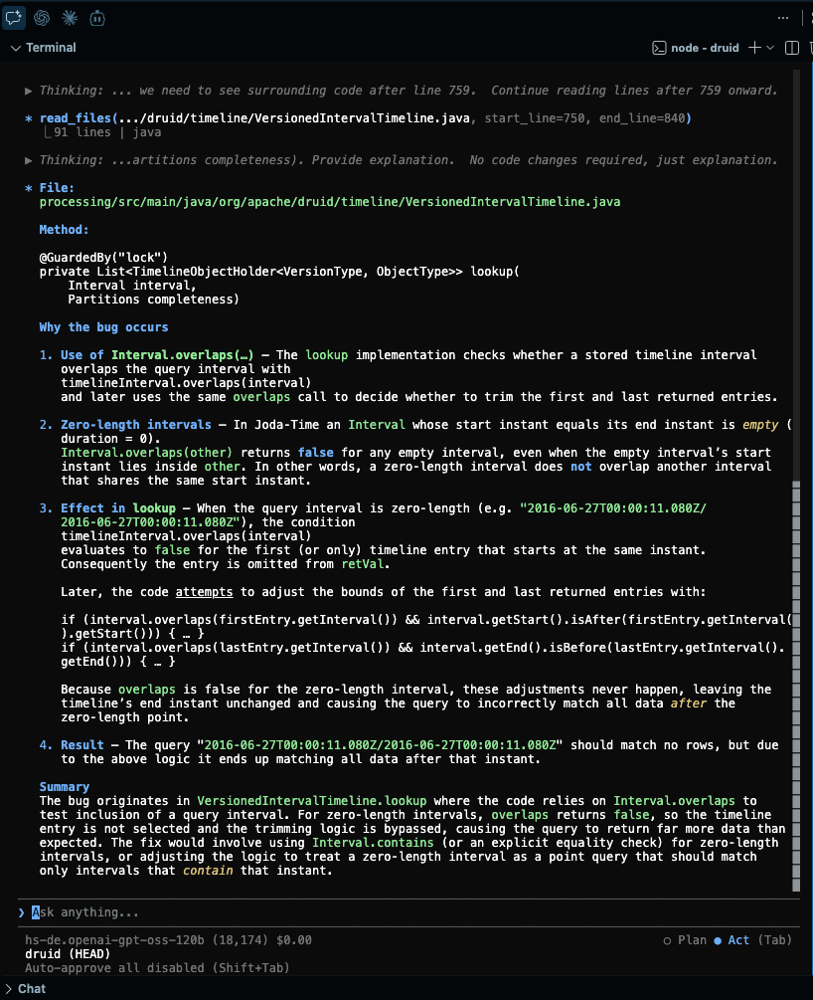
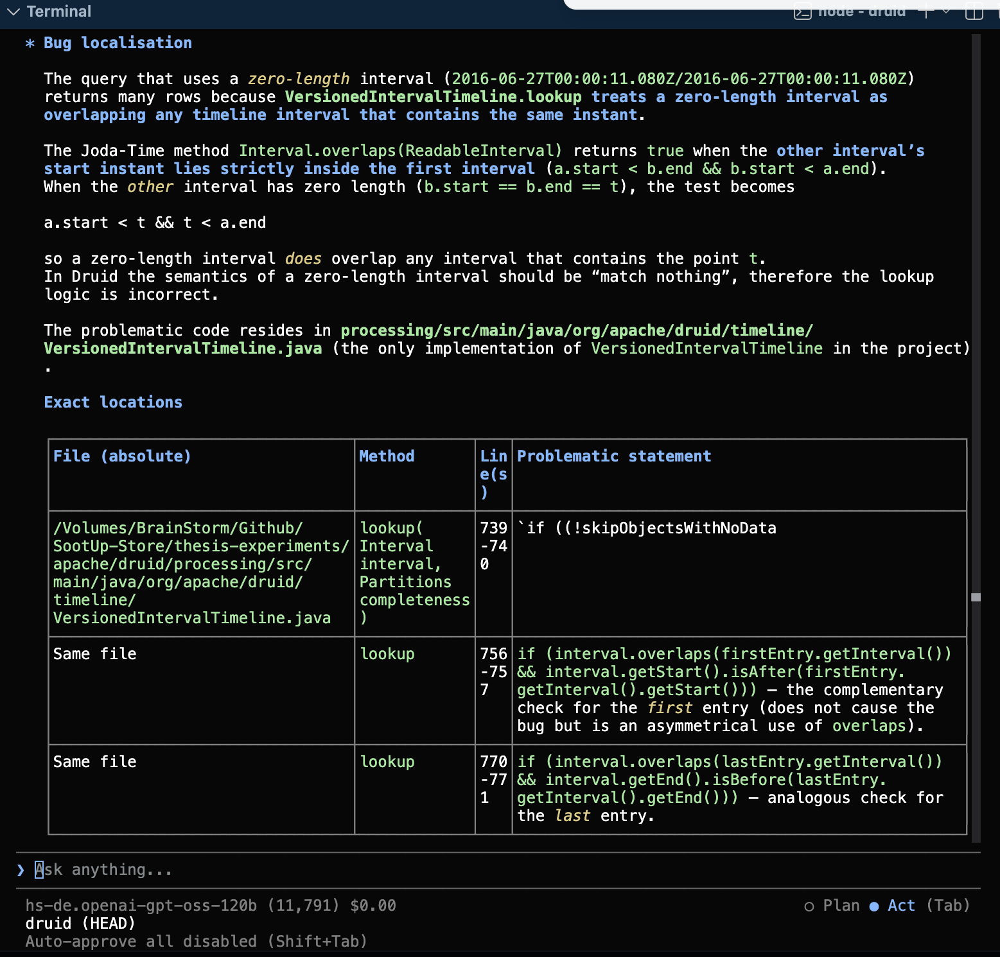
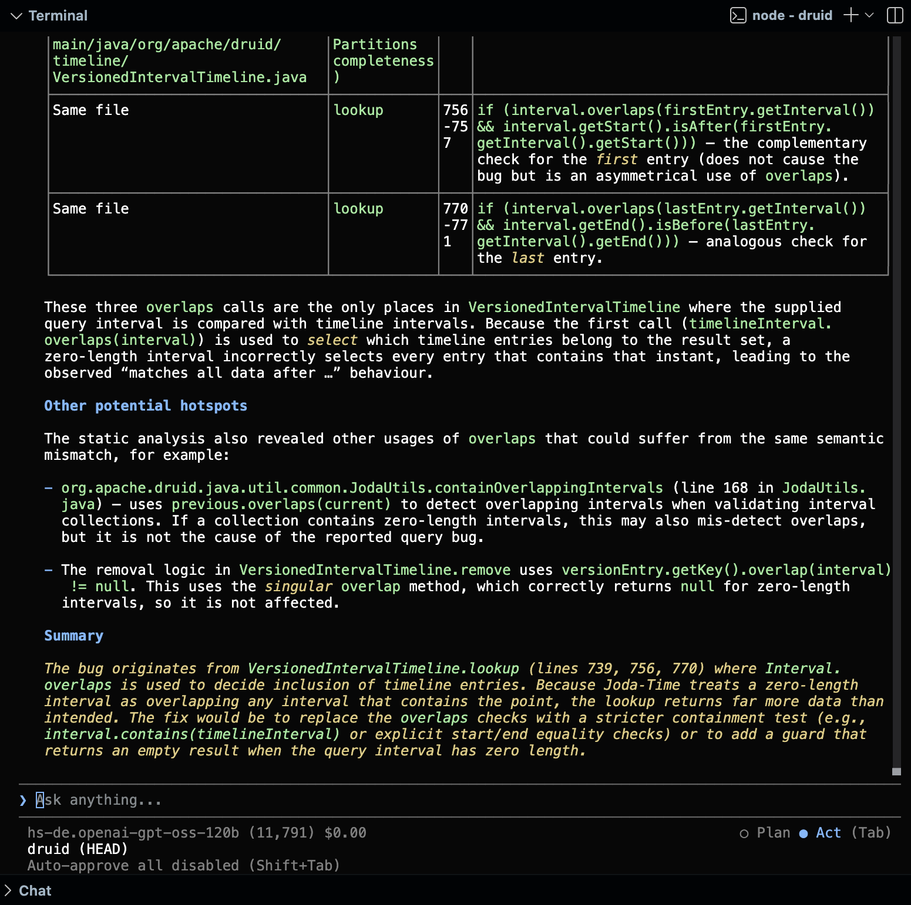

# Case Study 2: Apache Druid (Issue #14136)

## 1. Problem Statement

In Apache Druid (commit `a7d4162`), queries specifying zero-length time intervals (where `start == end`, e.g. `"2016-06-27T00:00:11.080Z/2016-06-27T00:00:11.080Z"`) unexpectedly matched and returned all data after that instant instead of matching nothing.

### The Architectural Challenge
The root cause involves subtle semantic behavior in Joda-Time's `Interval.overlaps()` method and spans multiple decoupled components across the query processing engine:
1. **`VersionedIntervalTimeline.java`**: Evaluates timeline segment bounds in `lookup()`. When given a zero-length query interval, `timelineInterval.overlaps(interval)` returns `false` for entry bounds, bypassing the trimming logic and leaking data.
2. **`JodaUtils.java`**: Implements interval condensation via an anonymous iterator (`JodaUtils$1` inside `condensedIntervalsIterator()`) and interval validation in `containOverlappingIntervals()`.
3. **`MultipleIntervalSegmentSpec.java`**: Normalizes input query intervals before timeline execution by delegating to `JodaUtils.condenseIntervals()`.

---

## 2. The 5 Generic SootUp Static Analysis Queries

To trace interval handling across these decoupled classes without project-specific heuristics, `SootUpAnalyzer` was used to execute 5 generic queries:

```bash
# Query 1: Method Inspection - Disassemble VersionedIntervalTimeline.lookup
mvn exec:java -Dexec.mainClass="SootUpAnalyzer" -Dexec.args="<path-to-druid>/processing/target/classes inspect-method org.apache.druid.timeline.VersionedIntervalTimeline lookup" -q

# Query 2: Method Inspection - Disassemble anonymous iterator JodaUtils$1.next
mvn exec:java -Dexec.mainClass="SootUpAnalyzer" -Dexec.args="<path-to-druid>/processing/target/classes inspect-method org.apache.druid.java.util.common.JodaUtils\$1 next" -q

# Query 3: Allocation Site Search - Locate where JodaUtils$1 is instantiated
mvn exec:java -Dexec.mainClass="SootUpAnalyzer" -Dexec.args="<path-to-druid>/processing/target/classes find-allocations org.apache.druid.java.util.common.JodaUtils\$1 org.apache.druid.java.util.common.JodaUtils" -q

# Query 4: Invocation Site Search - Find where JodaUtils.condenseIntervals is invoked
mvn exec:java -Dexec.mainClass="SootUpAnalyzer" -Dexec.args="<path-to-druid>/processing/target/classes find-invocations org.apache.druid.java.util.common.JodaUtils condenseIntervals org.apache.druid.query.spec.MultipleIntervalSegmentSpec" -q

# Query 5: Method Inspection - Disassemble JodaUtils.containOverlappingIntervals
mvn exec:java -Dexec.mainClass="SootUpAnalyzer" -Dexec.args="<path-to-druid>/processing/target/classes inspect-method org.apache.druid.java.util.common.JodaUtils containOverlappingIntervals" -q
```

---

## 3. Empirical Evaluation Results

### Condition A (Baseline: Source Code Only)
> 📄 **Input Prompt:** [View Condition A Prompt](../prompts/druid_14136/condition_a_prompt.md) *(Raw issue description + standard localization directive)*

Under Condition A, the LLM (`hs-de.openai-gpt-oss-120b`) exhibited heuristic bias: because the issue description explicitly mentioned `VersionedIntervalTimeline.lookup`, the model focused exclusively on that file and **completely missed `JodaUtils.java` and `MultipleIntervalSegmentSpec.java`**.



---

### Condition B (Augmented: With SootUp Static Analysis Facts)
> 📄 **Input Prompt:** [View Condition B Prompt](../prompts/druid_14136/condition_b_prompt.md) *(Issue description + 5 generic SootUp static analysis facts)*

When augmented with the SootUp facts, the LLM achieved **100% multi-file bug localization**, pinpointing the exact lines in `VersionedIntervalTimeline.java` and discovering the secondary hotspot in `JodaUtils.java`.

#### Step 1: Multi-File Identification Table


#### Step 2: Final Root Cause Diagnosis & Solution


---

## 4. Summary Comparison

| Target File | Method / Context | Detected in Condition A? | Detected in Condition B (SootUp Facts)? | Gold Patch Parity |
| :--- | :--- | :---: | :---: | :---: |
| `VersionedIntervalTimeline.java` | `lookup(Interval, Partitions)` (lines 739, 756, 770) | Yes | **Yes** | ✅ |
| `JodaUtils.java` | `containOverlappingIntervals` (line 168) | ❌ Missed | **Yes** | ✅ |
| `JodaUtils.java` | `condensedIntervalsIterator` (`JodaUtils$1`) | ❌ Missed | **Yes** | ✅ |
